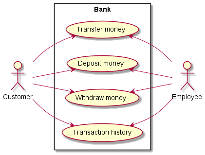
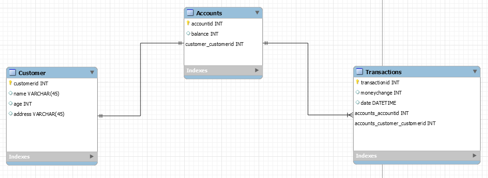

# Ebberød Bank opgave

[PDF version af aflevering](Ebberød Bank aflevering.pdf)

## Status

Vi har fået implementeret alle vores userstories og de virker som forventet

## Use case diagram

## EER diagram

## Userstories

1. Hævning
   Bruger mangler penge til at købe en ny bil.
   Bruger tjekker sin konto og hæver de penge brugeren skal bruge.
   Derefter kan brugeren se hvor meget der er tilbage på brugerens konto.

   - Acceptkriterier
   - Bruger får adgang til IT-systemet
   - Bruger får hævet penge
   - Bruger kan se tilbageværende beløb

2. Indsætning
   Bruger har lige haft fødselsdag og har fået en masse kontanter.
   Brugeren tager til banken og bruger indsætnings terminal.
   Derefter kan brugeren se hvor meget der er på brugerens konto.

   - Acceptkriterier
   - Bruger får adgang til IT-systemet
   - Bruger får indsat penge
   - Bruger kan se tilbageværende beløb

3. Kontoudskrift
   Bruger vil gerne se om brugeren's mor har nakket alle hans penge.
   Brugeren tager ned i banken og bruger en terminal til at få en kontoudskrift.
   Bruger får information omkring dato, beløb.

   - Acceptkriterier
   - Bruger får adgang til IT-systemet
   - Bruger kan se historien for hans konto

4. Overførelse
   Bruger har fundet noget han vil købe på dba.
   Bruger indtaster kontonr.
   Bruger sender penge til modtager.
   Bruger kan se hvor meget der er tilbage på kontoen.

   - Acceptkriterier
   - Bruger får adgang til IT-systemet
   - Bruger kan sende penge til modtager
   - Bruger kan se hvor meget der er tilbage på hans konto
	
## Refleksion

Opgaven er gået rigtig godt, vi er blev meget bedre til at arbejde sammen omkring et projekt. 
Blandt andet ved brugen af Git og KANBAN til at optimere vores samarbejde. 
Næste gang vil vi gerne være mere specifik med vores KANBAN board så det er nemmere at 
forstå hvad der mangler at laves. 

